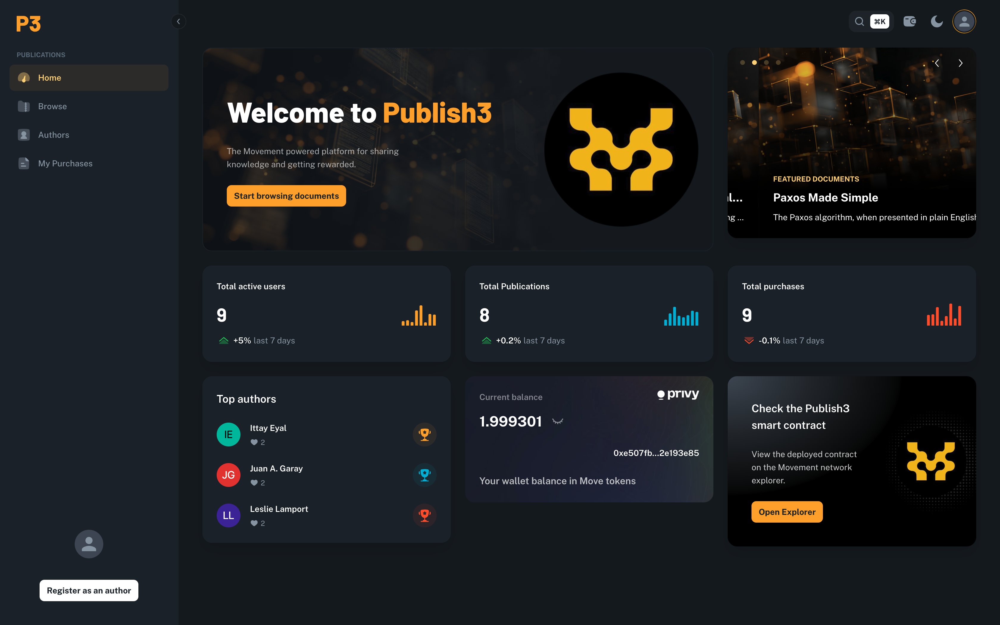
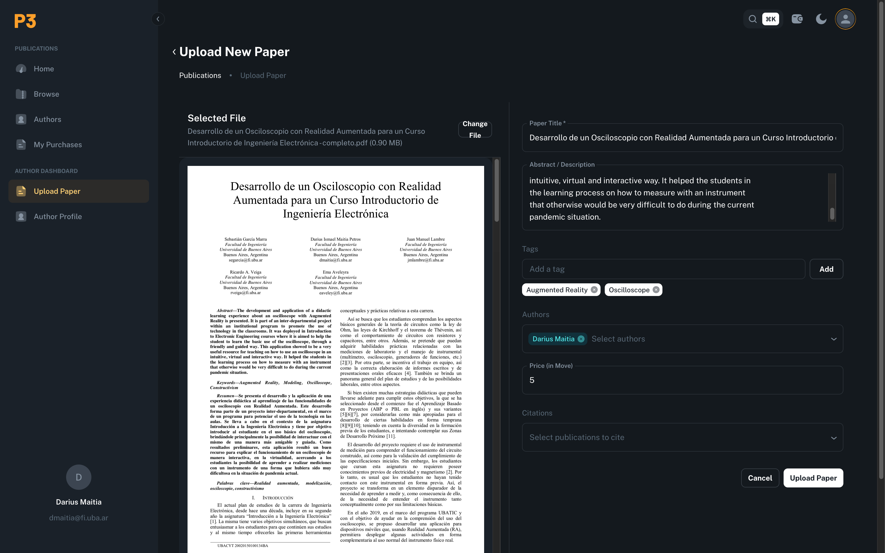
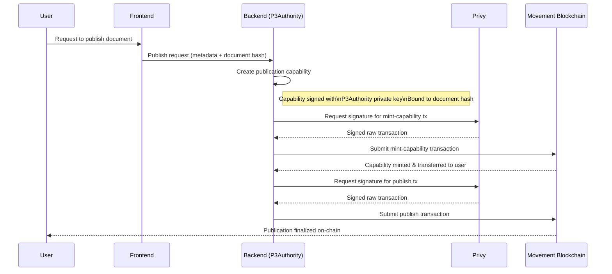
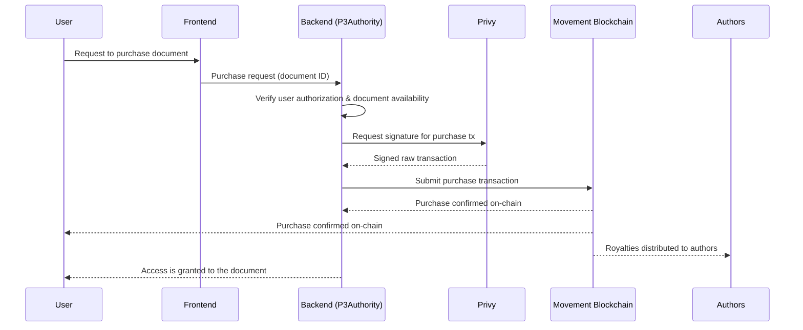

**Publish3** is a **Movement-powered platform** that enables users to publish, discover, and purchase academic documents in a fair, and transparent way, with on chain guarantees.

Authors specify the price and are rewarded directly for their work, readers gain permanent access to purchased knowledge, and the blockchain guarantees ownership, payments, and attribution—without relying on traditional publishing intermediaries.

Links
---
Demo: https://publish3-front.vercel.app/

Demo video: https://www.youtube.com/watch?v=VNNVStkRLE4

---

## Table of Contents

* [Overview](#overview)
* [Key Features](#key-features)
* [Business Model](#business-model)
* [Technical Architecture](#technical-architecture)

  * [Overall Architecture](#overall-architecture)
  * [Authentication](#authentication)
  * [Privy Embedded Wallets](#privy-embedded-wallets)
  * [Smart Contract Design](#smart-contract-design)
  * [Transactions Flow](#transactions-flow)
* [Technical Debt & Future Work](#technical-debt--future-work)

---
## Overview

Publish3 acts as both a **host** and an **intermediary** between authors and readers.

Users can:

* Browse published academic papers, documents, and research texts
* Read abstracts before purchasing
* Purchase documents and retain **permanent access**
* Trust the blockchain as the **source of truth** for ownership and payments

Each purchase is recorded on-chain and linked to the user’s **Privy embedded wallet**, ensuring verifiable ownership. The smart contract guarantees that payments are distributed **directly to the authors** of the publication.

### Publishing Content

Becoming an author is simple:

1. Register as an author
2. Upload your document
3. Define:

   * Title and metadata
   * Price (in MOVE)
   * Author list (supporting multiple authors)
4. Publish

Once submitted, the publication becomes instantly available for users to discover and purchase.

---

## Key Features

* Browse academic publications
* Publish research and documents
* Embedded wallets (no external setup required)
* Authors set their own prices
* Direct revenue distribution to authors
* Blockchain-backed ownership and payments

---

## Business Model

Publish3 aims to align the interests of **readers and authors**:

* Readers gain access to high-quality academic content at fair prices
* Authors receive the majority of the revenue generated by their work
* No traditional publishing intermediaries

### Platform Fee

* Publish3 takes **10%** of each purchase
* **90% goes directly to the authors**
* The platform fee covers:

  * Development
  * Infrastructure
  * Storage
  * Maintenance

> Note: The 10% fee is currently an arbitrary value. A future market analysis is required to properly balance sustainability and competitiveness.

---

## Technical Architecture

### Overall Architecture

* **Frontend**

  * React + Node.js
  * Material UI component library (licensed)

* **Backend**

  * Rust
  * Actix Web framework
  * MySQL database
  * S3-compatible storage for documents

* **Authentication**

  * Privy for user identity and wallet management
  * Token verification performed locally in the backend

* **Blockchain**

  * Smart contract deployed on **Movement M1 Testnet**

Although wallets are Privy-embedded, most wallet operations are coordinated by the backend. Privy is used primarily for **secure transaction signing**.

---

## Authentication

Authentication is handled via **Privy**, following their recommended integration flow.

### Supported Login Methods

* Google
* GitHub
* Email
* External wallets

On the frontend, a **Privy Provider** wraps the React application.

On the backend:

* An **Actix Web middleware** intercepts incoming requests
* Tokens are validated **locally** using Privy’s public key
* No direct API calls to Privy are required for verification

---

## Privy Embedded Wallets

* Wallets are **automatically generated** for authenticated users
* Wallet creation is triggered from the backend via Privy’s API
* Each wallet is associated with a **signature authority**
* This authority is used to request Privy to sign raw transactions

### Architectural Choice

Privy currently provides **Tier-2 support for Movement**, meaning:

* Wallet management cannot be fully handled client-side
* Transaction preparation and signing orchestration is handled by the backend
* Privy remains responsible for cryptographic signing only

---

## Smart Contract Design

The backend server acts as the **P3Authority**.

### Initialization Flow

1. The smart contract is deployed
2. The server immediately calls `initialize`
3. The server becomes the **publication authority**

### Publishing Flow

Publishing is secured using capability-based access control, ensuring that only authorized users can publish specific documents, while keeping all final actions user-signed and on-chain.

When a user publishes a document:

1. The server grants the user a **temporary capability**
2. The user mints the capability
3. The user calls the `publish` function

This design was made with the following ideas in mind:

* Only authorized users can publish
* Capabilities are single-use and document-specific
* Server cannot publish on behalf of users
* Users keep full control over transactions
* Prevents external or malicious contract calls

The backend can request Privy to sign a transaction on behalf of the client's wallet because each wallet is associated to a signature authority in Privy, whose private key is configured in the backend. So the wallets are not fully on the hands of the users, but this is a limitation due to the Tier 2 support that Privy provides for Movement. The only way to sign transactions using these wallets is this way through the backend. When tier 1 support is provided, we would migrate the wallet's ownership directly to the client application.

### Purchasing flow

---

## Transactions Flow

1. Transactions are **simulated first**
2. Estimated cost is shown to the user
3. The user approves or rejects the transaction
4. Upon approval:

   * A raw transaction is generated
   * Privy signs it on behalf of the user
   * The transaction is submitted to the blockchain

Neither purchases nor publications require server signatures—only user authorization. The server only issues the required capabilities.
